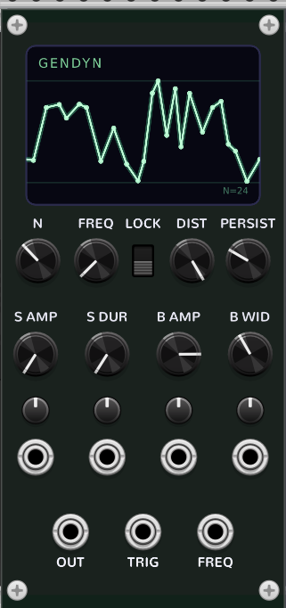
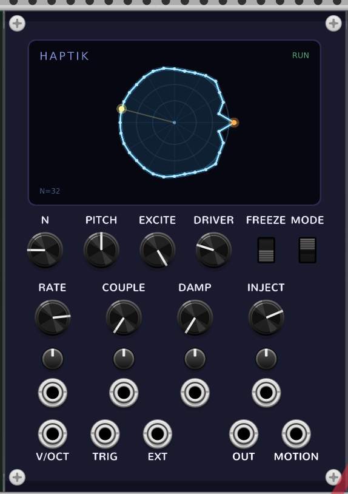
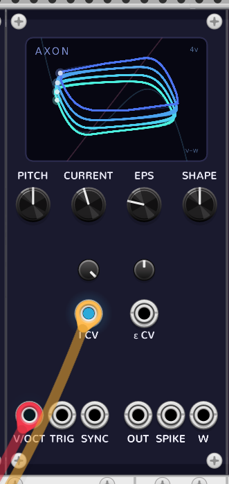
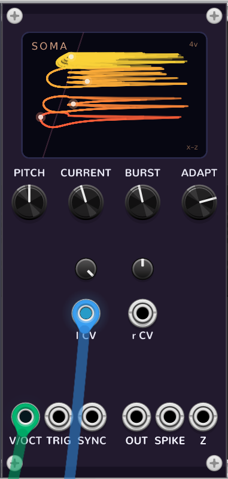
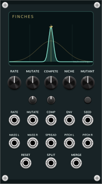
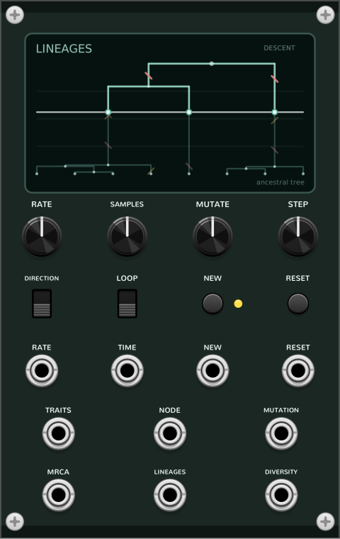

# Coalescent

Coalescent is a set of strange dynamical and generative instruments for **VCV
Rack 2**: gliding stochastic tones, scanned physical bodies, spiking neuron
voices, genetic circuits, ecological systems, and finite ancestral trees. Each
module turns a biological, physical, or stochastic model into a playable musical
surface. Most let a small dynamical system run continuously; those instruments
form the **Fluctuations** series (a label used throughout the docs, not a separate
brand). **Lineages** is the first generative genealogy module: it creates a
persistent finite musical structure, then plays or scrubs through it.

| Module | System | Character |
| --- | --- | --- |
| **GENDYN** | Xenakis dynamic stochastic synthesis (GENDY3) | a piecewise-linear waveform whose breakpoints random-walk each cycle — directed glissandi and living timbres |
| **Haptik** | scanned synthesis (mass–spring ring) | a ring of masses scanned at audio rate; pitch and timbre decoupled — pluck it, freeze it, or resonate it |
| **Neuron · Axon** | FitzHugh–Nagumo neuron | a spiking relaxation oscillator that crosses from drone to one-shot percussion on a single CURRENT knob |
| **Neuron · Soma** | Hindmarsh–Rose neuron | Axon's three-variable sibling: tonic spikes → bursts → chaos, all from injected current |
| **Operon** | Elowitz–Leibler repressilator (gene ring) | three genes repressing each other in a ring, ~120° out of phase — a native three-phase oscillator, LFO, and clock |
| **Bunnies** | Lotka–Volterra / Rosenzweig–MacArthur | predator & prey chasing each other a quarter cycle apart — a two-phase oscillator, LFO, and clock |
| **Foxes** | Hastings–Powell three-level food chain | grass, bunnies, and foxes move from a regular chase through period doubling into deterministic chaos — three correlated voices, LFOs, and event sources |
| **Finches** | trait-structured mutation–competition ecology | one phenotype broadens and branches into two persistent clusters — paired pitch and abundance CVs, spread CV, and split/merge events |
| **Islands** | four-population Wright–Fisher drift | four bounded allele-frequency CVs shaped by population size, selection, mutation, migration, and founder bottlenecks |
| **Archipelago** | eight-habitat spatial local adaptation | eight continuous trait distributions follow different environments while nearest-neighbor migration, a barrier, and climate shape a polyphonic geographic cline |
| **Lineages** | finite Kingman coalescent genealogy | a persistent ancestral tree played backward into convergence or forward into a related polyphonic mutation cluster |

| | | | |
| --- | --- | --- | --- |
| **GENDYN**<br> | **Haptik**<br> | **Axon**<br> | **Soma**<br> |
| **Operon**<br> | **Bunnies**<br> | **Foxes**<br> | **Finches**<br> |
| **Islands**<br> | **Archipelago**<br> | **Lineages**<br> | |

## Which module should I use?

- **Evolving digital noise / stochastic textures and glissandi?** → **GENDYN**
- **Plucked, struck, or resonant string-like bodies you can freeze?** → **Haptik**
- **Pingable spikes and rubbery, excitable neuron percussion or drones?** → **Axon**
- **Bursting, slow-fast, chaotic motion?** → **Soma**
- **Three-phase tones, three-phase LFOs, or a three-phase clock?** → **Operon**
- **Two-phase boom-bust motion, or a two-phase clock?** → **Bunnies**
- **Three linked ecological voices, or deterministic chaos you can dial in?** → **Foxes**
- **One CV voice visibly and audibly diversifying into two?** → **Finches**
- **Four bounded stochastic CVs with correlated drift and meaningful boundaries?** → **Islands**
- **An eight-voice spatial cline, range shift, or migration-versus-selection system?** → **Archipelago**
- **A repeatable family of related pitches that converges to unison or branches from it?** → **Lineages**

## The neuron pair

**Axon** and **Soma** are conceptual twins — the FitzHugh–Nagumo and Hindmarsh–Rose
spiking-neuron models — and they're built that way: both live in `src/neuron/` over
a shared `src/dsp/rk4.hpp` (a generic `coalescent::rk4<N>` step + pitch-adaptive
substepping, where the HR model extends the FHN one with a third, slow adaptation
equation). They
share a name prefix so they sort together in the browser and an accent/panel
language so the kinship reads visually. Both are polyphonic audio voices (up to
16 voices); Archipelago is also tagged **Polyphonic** because its TRAIT and MASS
CV outputs expose eight linked habitats on one cable. Lineages' TRAITS output is
polyphonic too: its channel count is fixed by the generated tree's 2–16 samples,
even while an uncommitted SAMPLES change marks that tree dirty.

## Modules — full documentation

- [GENDYN](docs/gendyn.md) — dynamic stochastic synthesis
- [Haptik](docs/haptik.md) — scanned synthesis
- [Axon](docs/axon.md) — FitzHugh–Nagumo neuron (+ polyphony notes)
- [Soma](docs/soma.md) — Hindmarsh–Rose neuron
- [Operon](docs/operon.md) — Elowitz–Leibler repressilator (three-phase)
- [Bunnies](docs/bunnies.md) — Lotka–Volterra / Rosenzweig–MacArthur predator–prey
- [Foxes](docs/foxes.md) — Hastings–Powell three-species food chain (deterministic chaos)
- [Finches](docs/finches.md) — trait-density evolutionary branching
- [Islands](docs/islands.md) — four-island Wright–Fisher genetic drift
- [Archipelago](docs/archipelago.md) — eight-habitat spatial local adaptation
- [Lineages](docs/lineages.md) — finite Kingman genealogy and neutral mutation

## Demo patches

The `patches/` folder holds ready-to-load `.vcv` demos for every module (free-run,
sync, polyphony, playable MIDI, and per-module character patches), plus
`coalescent_gallery.vcv` — a gallery of modules side by side for a quick look.
These demos are generated reproducibly by the scripts in `tools/` and, on WSL,
are also copied
into the Windows Rack patches folder when present. Separately, `patches/community/`
holds bigger, fully-produced patches contributed by users (hand-built, not
script-generated) — see its README for credits and setup. To regenerate the demos:

```bash
python3 tools/make_patches_neuron.py        # Axon + Soma
python3 tools/make_patches_haptik.py        # Haptik
python3 tools/make_patch_gendyn.py          # GENDYN 16-voice
python3 tools/make_patch_gendyn_2voice.py
python3 tools/make_patch_gendyn_cluster.py
python3 tools/make_patch_operon.py          # Operon (repressilator)
python3 tools/make_patch_bunnies.py         # Bunnies (predator-prey)
python3 tools/make_patch_foxes.py           # Foxes (food-chain chaos)
python3 tools/make_patch_finches.py         # Finches (evolutionary branching)
python3 tools/make_patch_islands.py         # Islands (Wright-Fisher drift)
python3 tools/make_patch_archipelago.py     # Archipelago (local adaptation)
python3 tools/make_patch_lineages.py        # Lineages (generative genealogy)
python3 tools/make_patch_gallery.py         # gallery view
```

On WSL, set `COALESCENT_SKIP_PATCH_INSTALL=1` to suppress the optional copy into
the Windows Rack patches folder. `make check` uses that mode in an isolated
temporary tree, confirms all 49 canonical archive contents match the checked-in
demos, and regenerates them a second time to prove same-toolchain byte identity.

## Install

**From the VCV Library (recommended).** Coalescent is in the official
[VCV Library](https://library.vcvrack.com/) — subscribe there, then in Rack use
*Library → Update all* (or *Sync* on Rack Pro). This keeps the plugin updated
automatically and is the easiest path for most users.

**Manual (development builds / unreleased changes).** Download the `.vcvplugin`
bundle for your platform from the
[latest GitHub Release](https://github.com/jeremycg/coalescent/releases/latest),
drop it into your Rack user folder's platform-specific plugins directory — since
Rack 2.5 this is `plugins-<os>-<cpu>/` (for example `plugins-lin-x64/`,
`plugins-win-x64/`, `plugins-mac-arm64/`), not a bare `plugins/` — which you can
open via Rack → *Help → Open user folder*. Then restart Rack.

## Build

Download the [VCV Rack 2 Plugin SDK](https://vcvrack.com/downloads) and point
`RACK_DIR` at the extracted path.

```bash
# Linux (native)
make RACK_DIR=~/Rack2-SDK/Rack-SDK dist

# Windows cross-compile (from WSL, MinGW-w64)
RACK_DIR=~/Rack2-SDK-win/Rack-SDK \
  CC=x86_64-w64-mingw32-gcc-posix CXX=x86_64-w64-mingw32-g++-posix \
  STRIP=x86_64-w64-mingw32-strip MACHINE=x86_64-w64-mingw32 make dist
```

`make dist` writes a `.vcvplugin` bundle to `dist/`. CI (`.github/workflows/build.yml`)
builds Linux x64, Windows x64 and macOS arm64 on every push, and attaches the
bundles to a GitHub Release on a `v*` tag.

### Tests

`make check` validates the manifest, documentation links, screenshots, and demo
patch archives/layouts, proves isolated patch regeneration parity, then runs
production cores and standalone replicas
(stability/calibration) plus the RK4 equivalence check — no Rack SDK needed. It's
the same guardrail CI gates releases on. A second target,
`make check-simd`, proves the float_4 (poly-SIMD) path matches the scalar kernel.
On Linux, `make check-rack` compiles the production Finches, Islands, and
Lineages wrappers and exercises persistence, finite outputs, and Rack's actual
context-menu Initialize path. Both SDK targets run in CI after the SDK download.

```bash
make check                                 # SDK-free stability/calibration/RK4
make check-simd RACK_DIR=~/Rack2-SDK/Rack-SDK   # SIMD equivalence (needs Rack headers)
make check-rack RACK_DIR=~/Rack2-SDK/Rack-SDK   # Linux Rack wrapper integration
```

If `libRack.so` dependencies are installed outside the system library path,
pass their colon-separated directories as `RACK_RUNTIME_LIBRARY_PATH`.

Each replica can also be built and run on its own:

```bash
g++ -O2 -o /tmp/t tools/stability/axon.cpp   && /tmp/t   # FitzHugh–Nagumo
g++ -O2 -o /tmp/t tools/stability/soma.cpp   && /tmp/t   # Hindmarsh–Rose
g++ -O2 -o /tmp/t tools/stability/haptik.cpp && /tmp/t   # scanned-synthesis ring
```

## Known character, not bugs

These are intended behaviours, called out so they don't read as defects:

- **GENDYN aliases** at high center frequencies / extreme settings — it's a raw
  piecewise-linear oscillator, not band-limited. Part of the GENDY3 sound.
- **Haptik Slow mode steps** the lattice every 256 samples by design (tactile,
  haptic-rate morphing); the readout is interpolated so it doesn't sound stepped.
- **Axon/Soma are excitable systems** — they click and spike on purpose, and
  their pitch is open-loop (CURRENT/EPS/BURST/ADAPT pull it a little).
- **Soma's chaotic region** sits *around* the documented CURRENT; nearby values
  shift with rate, drive, and modulation — chaos isn't a fixed point on the dial.
- **GENDYN, Haptik, Finches, Islands and Archipelago preserve their evolved internal
  state** with the patch (the running waveform, frozen lattice, trait distribution,
  allele frequencies plus deterministic RNG, or spatial population field), so the
  state you shaped reloads as itself. Axon, Soma, Operon, Bunnies and Foxes restart
  from their defined initial conditions; all knob and menu settings persist everywhere.
- **Lineages preserves the complete generated tree, mutations, cursor, transport,
  and local RNG state**, so a patch reloads exactly and, on the same build and
  platform, its next NEW produces the same replacement tree. SAMPLES and MUTATE
  edit the next tree: they mark the current one dirty but do not regenerate it
  until NEW.

## License

[GPL-3.0-only](LICENSE). © Jeremy Gray.
