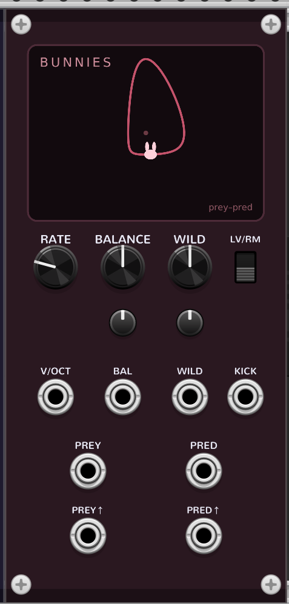

# Bunnies (predator–prey)

A predator–prey oscillator for VCV Rack 2. **PREY** (bunnies) and **PRED** (foxes)
chase each other by ~a quarter cycle: prey booms, predator booms a beat later,
prey crashes, predator follows. Part of the **Coalescent** plugin — see the
[main README](../README.md).



Two models, selected by the **LV / RM** switch, that keep the same musical meaning
on the knobs:

- **LV — Lotka–Volterra**: the classic *conservative* predator–prey loops. Neutral
  cycles with no attractor, so amplitude is something you *set* (via a servo, below).
- **RM — Rosenzweig–MacArthur**: a *self-correcting* limit cycle. Raise WILD past a
  threshold ("paradox of enrichment") and a stable boom–bust cycle switches on.

## How it works

Two coupled populations `x` (prey) and `y` (predator) in dimensionless time.

**LV mode:**
```
dx/dt = x·(1 − y)
dy/dt = gamma·(x − 1)·y
```
The fixed point is exactly `(1, 1)`. `gamma` (BALANCE) is the predator/prey
timescale ratio; near the fixed point the frequency is √gamma and the
predator/prey amplitude ratio is √gamma, while the phase offset is a quarter cycle
regardless. LV is **conservative** — a raw integration slowly drifts — so Bunnies
uses the closed-form conserved quantity `V = gamma·(x−ln x) + (y−ln y)` as a servo:
**WILD sets a target V0**, and each sample the state is nudged toward it. That kills
the drift *and* makes WILD mean "how big the boom-bust is."

**RM mode:**
```
g(x)  = x / (1 + b·x)                  (saturating predator intake)
dx/dt = x·(1 − x/K) − y·g(x)
dy/dt = s·(g(x) − c)·y
```
`K` (WILD) is prey carrying capacity / enrichment; `c` (BALANCE) is predator
efficiency. As K rises the coexistence point Hopf-bifurcates into a stable limit
cycle — self-correcting, so RM needs no servo. It rests at low WILD and cycles as
you raise it.

*(A 2-variable system like this can only rest or cycle — never chaos, by
Poincaré–Bendixson. Chaos needs a third species — that's [Foxes](foxes.md), the
three-level food chain.)*

Both modes integrate on the shared RK4 stepper with pitch-adaptive substepping
(same engine as [Axon](axon.md)/[Soma](soma.md)/[Operon](operon.md)). Populations
are clamped `> 0` (biology and the `log` in V both break at zero).

### Pitch is the simulation speed

Pitch = how fast the simulation runs; the period is emergent. RATE + V/OCT set the
speed, calibrated so LV's default reads C4 at 0 V, down to ~1 Hz for LFO/clock use.
By default BALANCE's √gamma effect on frequency is **compensated** so BALANCE reads
as timbre rather than a stealth pitch knob; WILD (and large orbits) still pull the
period, by design.

## Controls

| Control | Range | LV | RM |
| --- | --- | --- | --- |
| **RATE** | −8 … +4 oct | speed / pitch (0 = C4, bottom ≈ 1 Hz) | same |
| **BALANCE** | 0 … 1 | gamma (predator/prey timescale, relative swing) | c (predator efficiency) |
| **WILD** | 0 … 1 | V0 target (boom-bust size; holds where you set it) | K (enrichment: rest → cycle) |
| **LV / RM** | switch | Lotka–Volterra | Rosenzweig–MacArthur |

**BALANCE** and **WILD** have attenuverters + CV. **V/OCT** sums with RATE. **KICK**
is a continuous prey-force: short gates act like a perturbing kick (excitable in
RM-rest, a phase nudge on a cycle, a transient boom in LV where the servo restores
the set size); audio-rate signals act like cross-modulation.

Outputs: **PREY**, **PRED** — the two centered populations, soft-clipped to ±5 V,
~a quarter cycle apart. **PREY↑ / PRED↑** — a 10 V / ~1 ms pulse at each population
peak (a two-phase clock; most useful at LFO / low-audio rates — at high rates the
pulses crowd together).

## Display

The screen is the **phase-space orbit** — centered prey (x) vs predator (y). Rest
is a dot at the origin; oscillation is a closed loop whose size is WILD and whose
tilt shows the predator lag. A **bunny ambles slowly around the loop** so you can
follow it at any pitch. The loop is a phase-average of the orbit (the trajectory
binned by cycle phase), so it stays clean and closed — no aliasing at audio rate.

## Patches

`tools/make_patch_bunnies.py` writes three demos:

- **bunnies_1_lv_pair** — LV, PREY/PRED hard-panned L/R: the quarter-cycle chase
- **bunnies_2_rm_cycle** — RM; raise WILD from low and silence blooms into a cycle
- **bunnies_3_clock** — low rate (LV); PREY↑/PRED↑ → a two-phase tick (route the
  pops to your own envelopes/sequencers for a real two-phase clock)

Other ideas: LV, sweep WILD → the orbit grows and the waveform goes sine→spiky
while the amplitude holds; audio → KICK for FM-like sidebands; RM below the WILD
threshold with a clock → KICK for kick-and-settle wobbles.

## Notes / known limits

- **LV is conservative** — that's the character. Amplitude is *set* by WILD (the
  servo), not emergent; a kick reads as a transient, not a lasting change.
- **RM rests below the WILD threshold** — raise WILD (or lower BALANCE) if you hear
  silence.
- **Pitch is emergent / approximate.** WILD and large orbits pull the period; C4 is
  calibrated for the LV default.
- **Two-phase, not exactly quarter-cycle** in RM — the offset is amplitude- and
  parameter-dependent, especially in big relaxation cycles.
- **Aliasing.** Substeps keep the orbit accurate but don't band-limit the output;
  big spiky orbits alias at high pitch (v1 limit).
- **Residual DC.** PREY/PRED are centered on the population equilibrium, but a
  boom-bust orbit is asymmetric, so its mean isn't exactly that equilibrium and
  the soft-clip adds a little more — expect a small offset (roughly −0.2 V PREY /
  −0.6 V PRED at the LV default). Harmless for LFO/modulation use; add a DC blocker
  downstream if you need perfectly DC-free audio.
- **State is not saved.** Populations re-seed on load; params (including MODE) persist.

`tools/stability/bunnies.cpp` sweeps BALANCE × WILD in both modes at several pitches,
asserts x,y stay finite, positive, and bounded, and checks that the two peak lanes
remain ordered at fast rates where multiple RK4 substeps fall inside one audio
sample (it runs in `make check`).

## References

- A. J. Lotka, *Elements of Physical Biology*, 1925; V. Volterra, 1926.
- M. L. Rosenzweig & R. H. MacArthur, *Graphical representation and stability
  conditions of predator-prey interactions*, American Naturalist 97 (1963).
- [Lotka–Volterra equations — Wikipedia](https://en.wikipedia.org/wiki/Lotka%E2%80%93Volterra_equations)
- Rosenzweig, *Paradox of enrichment*, Science 171 (1971).
