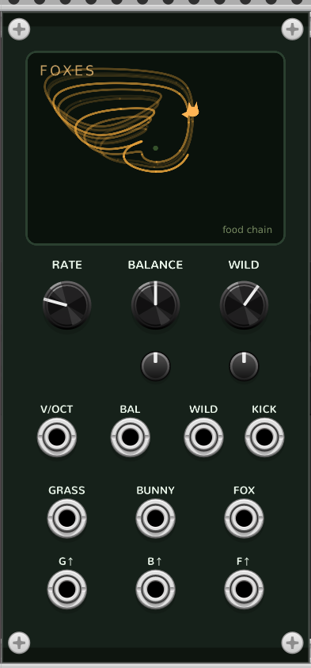

# Foxes (three-species food chain)

A three-trophic-level food-chain oscillator for VCV Rack 2, and the chaotic
sibling of [Bunnies](bunnies.md). **GRASS** → **BUNNY** → **FOX**: grass feeds
bunnies, bunnies feed foxes. Where a two-species ecology can only rest or cycle,
three levels give period doubling, multistability, and **deterministic chaos**.
Part of the **Coalescent** plugin's *Fluctuations* series — see the
[main README](../README.md).



Foxes is built on the nondimensional **Hastings–Powell** (1991) model — the
canonical three-species food chain with a documented route to chaos. Turn **WILD**
up and the regular chase period-doubles and dissolves into the famous "teacup"
strange attractor; the three population voltages stay ecologically legible even
when their timing turns irregular.

## How it works

Three populations `x` (grass), `y` (bunnies), `z` (foxes) in dimensionless time,
each trophic link a *saturating* response `f`:

```
f1(x) = a1·x / (1 + b1·x)      f2(y) = a2·y / (1 + b2·y)

dx/dt = x·(1 − x) − f1(x)·y            (grass / resource)
dy/dt = f1(x)·y − f2(y)·z − d1·y       (bunnies / consumer)
dz/dt = f2(y)·z − d2·z                  (foxes / top predator)
```

The canonical constants `a1=5, a2=0.1, d1=0.4, d2=0.01` are fixed at the published
values. Two parameters are exposed:

- **WILD** → `b1 = 1 + 5.2·wild²`, the primary bifurcation parameter. Low = a
  stable coexistence rest; raise it and the system Hopf-bifurcates into a regular
  three-population chase, then period-doubles, then reaches chaos near `b1 = 3`.
- **BALANCE** → `b2 = 1.75 + 0.5·balance`, the upper (bunny→fox) trophic
  saturation (2.0 at centre). It re-shapes the chase and shifts where the chaotic
  windows fall. The range is deliberately kept below `b2 ≈ 2.35`, above which a
  fox-extinction basin can capture the start state and hold FOX at its rail.

**Neither knob is a monotonic "amount of chaos".** Both WILD and BALANCE cross
back and forth between regular and chaotic windows — that non-monotonicity (and the
multistability around `b1 ≈ 2.5`, where the outcome can depend on history) is part
of the real bifurcation structure, not a bug.

The model is centered analytically: the positive coexistence equilibrium
`(x*, y*, z*)` is computed in closed form each sample and subtracted, so the
outputs swing around 0 V. It integrates on the shared RK4 stepper with
pitch-adaptive substepping (the same engine as [Axon](axon.md) / [Soma](soma.md) /
[Operon](operon.md)). The autonomous system is *dissipative* on the nonnegative
orthant, so — unlike [Bunnies](bunnies.md)' conservative LV mode — it needs **no
amplitude servo**; the positivity floor and state ceiling are a corrupt-input /
numerical backstop only, never a limiter in normal use.

### Deterministic chaos, not noise

Above the chaos threshold the trajectory never exactly repeats and is exquisitely
sensitive to initial conditions — two runs started a hair apart diverge. But it is
fully **deterministic**: no random number is drawn anywhere. The same controls and
initial state reproduce the same sound on the same build and platform. Chaotic
trajectories are not promised bit-identical across different compiler/platform
floating-point implementations. The irregularity is the geometry of a strange
attractor, not a noise source.

### Pitch is the simulation speed

RATE and V/OCT scale dimensionless simulation time; the period is emergent. The
speed is calibrated so the **default chase** (WILD 0.5) reads **C4 at 0 V**, down
to ~1 Hz for LFO / clock use — calibrated to the grass/chase rate (≈ 61.4 τ per
lap), which is the dominant pitch you hear. (Strictly the default already sits just
past the first period-doubling, so consecutive laps differ slightly and the full
cycle repeats every ≈ 123 τ; that subharmonic is ~20 dB down and barely audible.)
In chaotic regimes there is **no single fundamental period**, so pitch stops
meaning a musical note — V/OCT still doubles the simulation speed exactly (up to the
cap below), but it scrubs the *rate* of a broadband, aperiodic texture rather than transposing a
tone. WILD, BALANCE, and KICK all pull the emergent rate: like the rest of the
series, Foxes is a voice you tune by ear, not a precision VCO.

## Controls

| Control | Range | Purpose |
| --- | --- | --- |
| **RATE** | −8 … +4 oct | simulation speed / pitch (0 = C4 at the periodic default, bottom ≈ 1 Hz) |
| **BALANCE** | 0 … 1 | upper trophic saturation `b2` (bunny/fox link); reshapes the chase and shifts the chaotic windows |
| **WILD** | 0 … 1 | bifurcation parameter `b1`: rest → chase → period doubling → chaos (≈ 0.62) → deep crashes |

**BALANCE** and **WILD** have attenuverters + CV inputs. **V/OCT** sums with RATE.
**KICK** is a continuous force into grass (`dx/dt`): short gates perturb or re-time
the ecology (a nudge on a cycle, a transient bloom-and-recover), and audio-rate
signals cross-modulate it. The sanitized +/-15 V input range is internally scaled so
standard 10 V gates remain strong without exceeding the integrator's stable drive.

Outputs — **GRASS**, **BUNNY**, **FOX**: the three equilibrium-centered populations,
each on its own fixed gain and soft-clipped (`tanh`) to ≈ ±5 V. The gains
(`8 / 18 / 2.5`) equalize the very different native ranges, so the three read at
comparable level. **G / B / F** (the `↑` peak row): a 10 V / ~1 ms pulse at each
population's local maxima.

Peak outputs are **events, not a guaranteed one-per-cycle clock**. At the periodic
default you get a clean repeating grass → bunny → fox order, one tick each per lap.
In chaos that regularity dissolves: multiple grass/bunny peaks can fall between two
fox peaks, and the order and count vary — which is musically useful, and is left
intact rather than quantized into a fake three-phase clock. The three populations
are also **not** equally-spaced phases (this is an asymmetric food chain, not
[Operon](operon.md)'s symmetric 120° ring).

## Display

The screen is a **stable attractor portrait** — a projected `(grass, bunny, fox)`
phase trail, fixed-scaled and drawn in an isometric projection, with the brightness
running dark→amber along the captured path. A small fox-amber **playhead** ambles
along it at a slow, watchable pace (reversing at the ends, so there is no jump) —
the real system runs at audio rate, far too fast to follow directly, so the fox is a
slowed proxy that traces the same shape, exactly as the bunny ambles Bunnies' loop.
At the periodic default the trail is a compact tidy loop; raise WILD and it grows and
folds into the recognizable Hastings–Powell **teacup** strange attractor. The faint
green dot at center is the coexistence equilibrium.

It is a **portrait, not a live oscilloscope**: it shows a post-settling trajectory from
the current regime, and it holds that shape steady. When you move a control it allows
one trail-length for settling, captures a complete fresh trajectory, and then updates
to the new shape at a sweep endpoint — so you never see a half-old/half-new smear, but under
*continuous* modulation (an LFO on WILD, or audio-rate KICK) it holds the last
completed portrait rather than animating every wiggle. Close to a bifurcation the
system can settle more slowly than that allowance, so a portrait may retain some real
transient motion. It is a chronological,
decimated trajectory — captured at uniform dimensionless-time spacing so the shape is
independent of pitch — **not** a phase-averaged loop, a perspective camera, or any
measurement of "how chaotic" the system is. Because it is fixed-scaled (never
auto-normalized) a bigger orbit genuinely draws bigger; deep-WILD excursions that
would run off the screen are softly bent back toward the bezel. During fast spikes,
consecutive captured points are far apart, so the trace streaks — honest motion, not
a glitch.

## Patches

`tools/make_patch_foxes.py` writes four demos (Fundamental + Core only):

- **foxes_1_food_chain** — the periodic default (WILD 0.5); GRASS/BUNNY/FOX mixed
  at conservative level — the regular chase as a slowly drifting drone.
- **foxes_2_teacup** — canonical chaos (WILD 0.62 → `b1 ≈ 3`), a touch below C4:
  the strange attractor as an irregular, broadband, correlated voice.
- **foxes_3_transition** — a period-doubling / multipeak point (WILD 0.57 →
  `b1 ≈ 2.7`) between the regular chase and full chaos.
- **foxes_4_events** — slow RATE; the three peak gates (G/B/F ↑) as offset ticks
  that turn irregular in chaos (route them to your own envelopes/sequencers).

Other ideas: FOX or the G/B/F peaks into a filter/VCA to open it in time with the
population swings; audio into KICK for cross-modulation; nudge WILD slowly across
`b1 ≈ 2.5` to hear the period-doubling cascade; a slow LFO on BALANCE to drift
between regular and chaotic windows.

## CPU & polyphony

Foxes is **monophonic** — three linked outputs are already the voice (the
[Bunnies](bunnies.md)/[Operon](operon.md) precedent). CPU is dominated by the
integrator: `oversample`-free, but `K` RK4 substeps per sample (`K` 2…64, rising
with pitch). The derivative is cheap — only multiplies, adds, and two rational
responses, no `pow`/`exp` — so per substep it is lighter than [Operon](operon.md)'s
moving-Hill path, and being mono it is far cheaper than a 16-voice
[Soma](soma.md). The cost rises steeply only at very high RATE, because the natural
period (≈ 61 τ) is long, so each audio cycle needs many τ of simulation and hence
many substeps.

Optimized production-wrapper measurements at 48 kHz, excluding UI drawing, were:

| Setting | Approximate load on one core |
| --- | ---: |
| RATE 0 | 1.19% |
| RATE +4 | 12.87% |
| RATE +4 plus V/OCT +4 V | 15.26% |

These are measurements from the development i5-9600K, not portable guarantees.
Rack overhead, compiler flags, host settings, and CPU model all change the
result; the last row demonstrates the bounded extreme rather than a recommended
musical setting.

## Notes / known limits

- **WILD is not a monotonic chaos knob.** It (and BALANCE) cross regular and
  chaotic windows; there are multistable windows near `b1 ≈ 2.5` where the outcome
  depends on history. The default is periodic; canonical chaos sits near WILD 0.62.
- **The default is a period-2 chase**, sitting just past the first period-doubling
  (b1 = 2.3): consecutive laps differ slightly and the true cycle is ≈ 123 τ. It
  reads as a clean C4 because the ≈ 61 τ chase rate dominates (the subharmonic is
  ~20 dB down); turn WILD down a hair (≈ 0.49) for a strictly period-1 orbit.
- **Pitch is emergent / approximate**, and undefined in chaos — C4 is calibrated
  for the periodic default only. V/OCT scrubs speed, not pitch, in a chaotic regime.
- **Simulation-speed ceiling.** Because the period is long, the internal substep
  budget caps the effective rate: at 44.1 kHz the ceiling is ≈ 4.6 kHz (about D8),
  rising with sample rate (≈ 5 kHz at 48 kHz, ≈ 10 kHz at 96 kHz). The RATE knob's
  top (+4 oct ≈ C8) is reachable; V/OCT above that stops tracking. This is a
  documented speed cap, not a bug.
- **Aliasing.** Substeps keep the trajectory accurate but do **not** band-limit
  sharp population outbreaks; high-rate settings can alias (v1 has no oversampling).
- **Residual DC, and a rail-biased FOX at high settings.** Outputs are centered on
  the population equilibrium, but a boom-bust orbit is asymmetric, so its
  time-average isn't exactly that equilibrium and the soft-clip adds a little more —
  expect an offset, largest on **FOX**. At the default it's about −0.9 V; in deep
  chaos and toward the top of BALANCE/WILD, **FOX becomes strongly burst-like** — its
  mean drops to roughly −3 V and it sits within 0.1 V of the −5 V rail more than half
  the time (≈ 70% at BALANCE 1 / WILD 0.7), punctuated by sharp positive spikes when
  the foxes boom. That's the character of a top predator that crashes and recovers,
  not a fault — but it's a spiky, mostly-low signal there, not a symmetric wave. Add
  a DC blocker downstream if you need DC-free audio.
- **The display is a fixed-scaled, projected, decimated trajectory** — not a
  camera and not a chaos meter. Deep-WILD orbits are softly limited to the screen.
  After a control change it discards one trail-length as settling time; near the Hopf
  boundary, where convergence is unusually slow, the next portrait can still include
  a small residual transient. At very low RATE a complete refresh can take around
  15 seconds plus the wait for a playhead endpoint.
- **State is not saved.** Populations re-seed to a deterministic point on the
  default attractor on load; params persist through Rack as usual.

`tools/stability/foxes.cpp` exercises the shared SDK-free production core in
`make check`. It asserts the analytic equilibrium, the Hopf location, the default
period → RATE_CAL (within 5 cents), a positive Lyapunov estimate with a broad
fox-maxima return map at `b1 = 3` versus ≈ 0 at the default, and
finite/positive/bounded behavior across the whole BALANCE × WILD × KICK box.
Unforced (KICK = 0) operation never touches the positivity floor; a sustained
*negative* KICK legitimately pushes grass onto it (negative forcing breaks
positivity by design), which is why the floor is a clamp, not a limiter.

## References

- A. Hastings & T. Powell, *Chaos in a Three-Species Food Chain*, Ecology 72 (1991),
  896–903. [doi:10.2307/1940591](https://doi.org/10.2307/1940591) — the model, the
  canonical constants, the `b1` route to chaos, and the "teacup" attractor.
