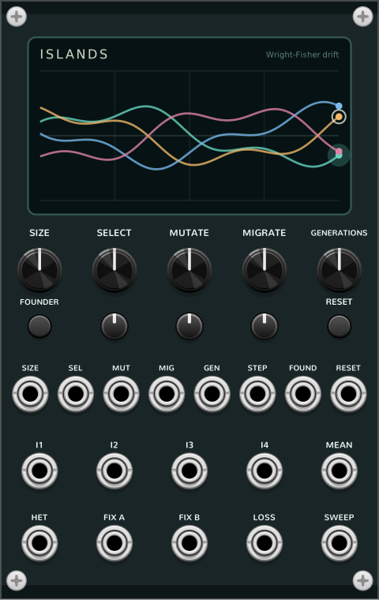

# Islands (Wright-Fisher drift)

A four-lane stochastic CV source for VCV Rack 2. Islands follows the frequency
of allele **A** in four finite populations. Every generation applies selection,
mutation, and migration, then draws the next populations with exact binomial
sampling. Small populations make bold, angular excursions; large populations
drift in finer steps. Part of the **Coalescent** plugin's *Fluctuations* series
-- see the [main README](../README.md).



Unlike noise or an unconstrained random walk, every lane has meaningful 0 and 1
boundaries. Selection can lean the motion toward one allele, mutation can restore
an allele after it disappears, and migration can pull four independent paths into
a correlated family. The result is bounded random modulation with a visible
population-genetic cause.

## How it works

Island `i` holds an allele-A frequency `p_i` between 0 and 1. A generation is
computed synchronously in four stages:

```text
selection:  q_i = p_i * exp(s) / (1 - p_i + p_i * exp(s))
mutation:   r_i = mu + (1 - 2*mu) * q_i
migration:  z_i = (1 - m) * r_i + m * mean(r_1 ... r_4)
sampling:   K_i ~ Binomial(N, z_i),   p_i' = K_i / N
```

- `N` is the number of **allele copies** in each island.
- `s` is the log-fitness advantage of allele A. Positive values favour A;
  negative values favour B with exactly the opposite strength.
- `mu` is the symmetric A-to-B and B-to-A mutation probability per copy and
  generation.
- `m` is the fraction drawn from the common migrant pool before reproduction.

All four migration targets are calculated before any island is redrawn, so the
result does not depend on island processing order. The binomial draw is the
Wright-Fisher step: its conditional variance is `z_i * (1 - z_i) / N`, which is
why low SIZE wanders and fixes much faster.

This is a **genic, haploid allele-copy model**. It does not simulate diploid
genotypes, dominance, recombination, linked loci, age structure, or changing
population abundance. `N` can also be read as the number of independently sampled
gene copies rather than a census of organisms.

## Controls

| Control | Range | Purpose |
| --- | --- | --- |
| **SIZE** | `N = 8 ... 4096` allele copies | effective population size on a log2 scale; clockwise makes each random step smaller and smoother |
| **SELECT** | `s = -0.25 ... +0.25` | signed log-fitness advantage; left favours B, right favours A |
| **MUTATE** | exact `0`, then `1e-6 ... 0.05` | symmetric mutation probability per copy and generation |
| **MIGRATE** | `m = 0 ... 1` | coupling through the common migrant pool; 1 gives all islands the same pre-sampling probability |
| **GENERATIONS** | stopped ... `200/s` | internal generation rate; exponential above the stopped position |
| **FOUNDER** | button | bottlenecks the next island to eight sampled copies |
| **RESET** | button | returns all four islands and event memory to the deterministic initial state |

SIZE is logarithmic and displayed as an integer allele-copy count. Changing it
does not round or redraw the current frequencies: the new `N` is used on the next
real generation. SELECT, MUTATE, and MIGRATE have bipolar attenuverters. At full
attenuation, 10 V spans the exposed knob range. The SIZE and GENERATIONS CVs are
exponential: 1 V doubles `N` or the running generation rate, subject to their
documented limits.

MUTATE has a true zero at the bottom rather than merely a very small probability.
That matters: with zero mutation, an allele lost from all four islands cannot
return by itself. The rest of the knob is logarithmic so biologically small rates
remain controllable.

The internal clock stops at the bottom of GENERATIONS. **STEP** always advances
exactly one synchronous generation on a rising trigger, so Islands can be used as
a clocked random source. STEP and the internal clock may also be used together;
STEP does not reset the internal clock phase.

### Founder events

Each FOUNDER trigger selects the next island in the repeating order 1, 2, 3, 4.
That island alone is resampled from its current frequency with `N = 8`, then
holds that eight-copy population until the next ordinary generation redraws it at
the current SIZE. It is a bottleneck, not a reset and not a new random
distribution. The rotating target is saved with the patch and shown on the
display.

FOUNDER, RESET, and STEP accept short triggers without waiting for the next
generation tick. Parameter changes alter future transition probabilities; they
never silently redraw the population already on screen.

## Inputs

| Input | Meaning |
| --- | --- |
| **SIZE** | exponential population-size CV; 1 V doubles the allele-copy count |
| **SELECT** | selection CV through its attenuverter |
| **MUTATE** | mutation CV through its attenuverter |
| **MIGRATE** | migration CV through its attenuverter |
| **GEN** | exponential generation-rate CV; 1 V doubles the running rate |
| **STEP** | rising edge advances one generation |
| **FOUND** | rising edge applies the rotating eight-copy founder bottleneck |
| **RESET** | rising edge restores the initial population |

## Outputs

| Output | Meaning |
| --- | --- |
| **I1 ... I4** | allele-A frequency of each island, `0 ... 10 V` |
| **MEAN** | mean allele-A frequency across the four islands, `0 ... 10 V` |
| **HET** | normalized within-island heterozygosity `4 * mean(p_i * (1 - p_i))`, `0 ... 10 V` |
| **FIX A** | 10 V while every island is exactly fixed at A |
| **FIX B** | 10 V while every island is exactly fixed at B |
| **LOSS** | 10 V / approximately 1 ms pulse on entry into either global fixation state |
| **SWEEP** | 10 V / approximately 1 ms pulse when MEAN enters the A-high or B-high region |

HET is 10 V when every island is at `p = 0.5` and 0 V when every island is
internally fixed. Four islands split between all-A and all-B also produce 0 V HET:
the output measures **within-island polymorphism**, not between-island divergence.
The four lane outputs themselves expose that difference directly.

FIX A/B are exact global states, not near-threshold comparators. LOSS is therefore
the event edge of those gates and deliberately does not report a single island
touching a boundary. With nonzero mutation, global loss need not be permanent.

SWEEP is a direction-agnostic near-fixation event: it fires when MEAN crosses into
`>= 0.9` or `<= 0.1`. The A side re-arms below 0.8 and the B side above 0.2, so
hovering near a boundary does not chatter. It is a musically useful sweep marker,
not proof that natural selection rather than drift caused the crossing.

## Interpolation and display

Ordinary generations and founder bottlenecks are discrete events. I1-I4, MEAN,
and HET linearly interpolate toward each new endpoint at audio rate, turning the
same process into continuous, patch-friendly CV. A free-running generation uses
one generation period as its ramp time. STEP or FOUNDER uses that same time while
the clock runs, or a fixed 50 ms transition while it is stopped. A new event that
arrives before the old ramp finishes starts from the current voltage, so it does
not create a discontinuity. RESET is immediate and returns the outputs to 5 V / 5
V / 5 V / 5 V, MEAN to 5 V, and HET to 10 V.

The ramp duration is captured when its endpoint is created. Moving GENERATIONS
changes the clock immediately and sets the duration of future ramps, but does not
retime a transition already in flight. FIX A/B and the event pulses follow the
discrete model immediately; they can therefore lead a continuous output that is
still travelling to the corresponding endpoint.

The display uses a fixed `0 ... 1` vertical scale and retains recent population
endpoints for all four islands, including STEP and FOUNDER changes. This makes
population-size texture, migration-led convergence, founder jumps, and fixation
visible without auto-scaling the process into a generic waveform. Its endpoint
dots show the discrete state rather than the interpolated output voltage. An
outline marks the next founder target, and the most recently bottlenecked island
briefly glows.

## Patching Islands

For four related pitch modulators, attenuate each island output by 0.1 before
sending it to oscillator V/OCT. The full genetic interval then spans one octave:

```text
I1 ... I4 -> four attenuators at 0.1 -> four oscillator V/OCT inputs
```

Other useful patches:

- Send I1-I4 to four VCA or filter CV inputs. Low SIZE gives abrupt individual
  moves; high SIZE gives finer, more persistent contours.
- Raise MIGRATE to make four voices cohere without becoming identical: their
  expected frequencies meet, but each island still receives its own binomial draw.
- Modulate SELECT slowly around zero for a probabilistic call-and-response between
  the A and B boundaries.
- Use HET to open reverb, diffusion, or modulation depth near balanced populations,
  then close it as the islands fix.
- Run with GENERATIONS stopped and clock STEP from a sequencer for four correlated,
  bounded sample-and-hold lanes with interpolated edges.
- Patch SWEEP and LOSS to structural events. SWEEP anticipates an extreme state;
  LOSS confirms exact global disappearance of one allele.
- Trigger FOUNDER periodically at high SIZE. One otherwise smooth voice makes a
  large bottleneck jump, rotating through the quartet on successive triggers.

## State, determinism, and limits

### Seeds, duplication, and independence

Factory-fresh Islands instances use RNG seed `42` and stream `54`. Two such
instances with identical controls and event schedules therefore produce the same
populations; this intentional reproducibility is not statistical independence. A
duplicated module retains the latest published population, RNG state, and RESET
seed/stream pair, so it keeps the same stochastic identity and per-generation
draw sequence under matching controls and events. The duplicate need not be
sample-aligned with the original because presentation state is snapshotted at
control rate.

The context menu provides two seed actions:

- **New random seed** chooses a new seed/stream pair, resets the population, and
  makes that pair the instance's deterministic RESET identity. Later RESET
  button/input events restart the same chosen sequence; they do not choose another
  pair.
- **Restore factory seed** resets the module and restores seed `42` / stream `54`.

Rack's **Randomize** action also reseeds Islands. Use New random seed or Randomize
on one instance when separate modulators should have independent streams. Merely
changing SIZE, SELECT, MUTATE, MIGRATE, or GENERATIONS can make their output paths
look different, but it does not assign a new random stream and therefore does not
guarantee statistical independence.

### Saved state and limits

- **Population state, interpolation phase, event memory, founder target, the
  instance's RESET seed/stream pair, and the complete deterministic RNG state are
  saved with the patch.** Reloading on the same build continues the authored
  frequencies and future random sequence rather than merely restarting from a
  seed/stream pair.
- Saved allele counts and integer RNG state are portable. Future evolution is not
  guaranteed bit-exact across platform/compiler builds because selection,
  mutation, and migration use floating-point probability math before each
  deterministic integer RNG draw.
- The PCG used for evolutionary draws is owned by the module. Rack's global random
  source is consulted only when New random seed or Randomize explicitly reseeds it.
- Simulation work occurs only when a generation is due. The audio callback does a
  bounded amount of interpolation and trigger handling. On the development x86-64
  machine, 200 generations/s used about 0.35% of one core; the exact cost varies by
  CPU, compiler, and host settings.
- The four islands have equal `N`, mutation, and selection. They differ only through
  stochastic history and founder events; there is no per-island environment knob.
- Migration mixes probabilities before reproduction. Even at MIGRATE = 1, the four
  realized populations can differ because their binomial draws are independent.
- Linear interpolation is a musical presentation layer. Intermediate voltages are
  not extra simulated generations, and gates/events describe the discrete endpoints.
- A high mutation rate pulls frequencies toward 0.5 and makes exact fixation brief
  or unlikely. That is expected behavior, not a failed FIX detector.

The standalone Islands stability suite exercises exact binomial support, the
neutral mean and variance, deterministic selection/mutation/migration maps,
fixation and sweep event semantics, founder rotation, hostile inputs, replay, and
state restoration. It runs in `make check`.

## Demo patches

`tools/make_patch_islands.py` writes four Core/Fundamental-only patches:

- **islands_1_neutral_lanes** -- four neutral island frequencies become a slowly
  shifting four-voice chord.
- **islands_2_migration** -- slow migration modulation moves the voices between
  independent drift and correlated motion.
- **islands_3_selection_sweep** -- periodic reset lets positive selection repeat;
  SWEEP and LOSS are heard as separate event channels.
- **islands_4_founder** -- periodic founder bottlenecks rotate through four
  otherwise smooth, large populations and make one voice jump at a time.

## References

- R. A. Fisher, *The Genetical Theory of Natural Selection*, 1930.
- S. Wright, *Evolution in Mendelian Populations*, Genetics 16 (1931), 97-159.
- W. J. Ewens, *Mathematical Population Genetics*, second edition, 2004.
