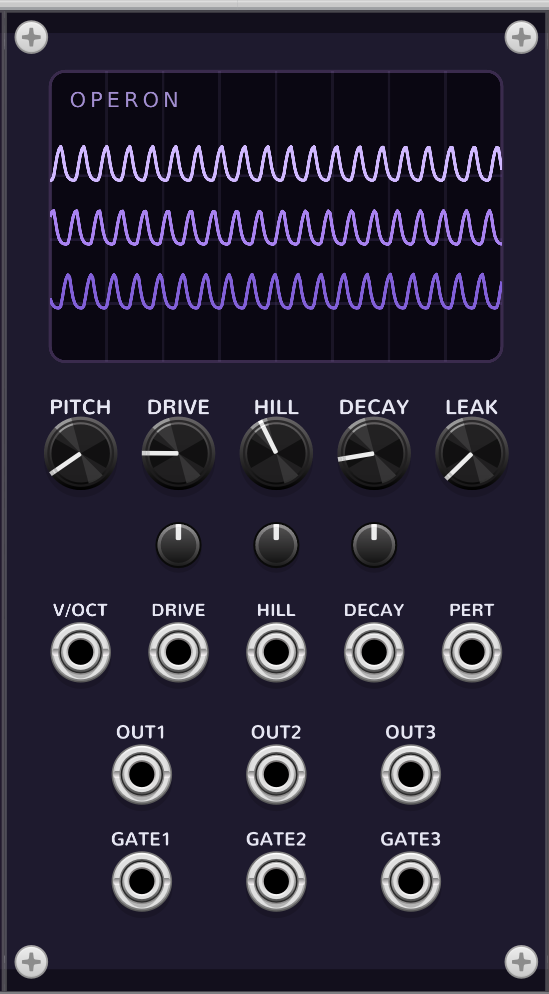

# Operon (repressilator)

Three-phase oscillator for VCV Rack 2, built on the **repressilator** — the
synthetic gene circuit of Elowitz & Leibler (2000): three genes in a ring, each
repressing the next, whose delayed negative feedback produces sustained
oscillation. Part of the **Coalescent** plugin — see the [main README](../README.md).



Because the three repressor proteins settle ~120° out of phase, Operon is
natively a **three-phase** voice: patch the three OUTs to stereo/quad, to three
oscillators, or — at sub-audio speed — as a three-phase LFO and a native
three-phase clock (the three GATEs).

## How it works

Six coupled variables in dimensionless time — an mRNA `m_i` and a protein `p_i`
for each gene `i`, where gene `i` is repressed by the protein of the previous
gene in the ring (`rep_i = p_{i-1}`):

```
dm_i/dt = −m_i + α / (1 + rep_iⁿ) + α₀        (transcription, repressed)
dp_i/dt = −β·(p_i − m_i)                        (translation + decay)
```

- **α (DRIVE)** — promoter strength. Must exceed a Hopf threshold to oscillate;
  below it the ring rests at a stable steady state (silence). The threshold is
  low on the dial (~α = 3 at default), so most of DRIVE is oscillating.
- **n (HILL)** — repression cooperativity. Low n → smooth, near-sinusoidal; high
  n → sharp relaxation pulses, and a wider oscillating region.
- **β (DECAY)** — protein/mRNA decay ratio. Sets period, phase spacing and duty;
  extremes suppress or unbalance the phases.
- **α₀ (LEAK)** — basal transcription floor, applied equally to all three genes.

This is the **dimensionless** form from [BioModels BIOMD0000000012](https://www.ebi.ac.uk/biomodels/BIOMD0000000012).
The classic Elowitz voicing is roughly **DRIVE ≈ 216, HILL 2, DECAY 0.2, LEAK 0.2**
— a larger, slower swing; Operon's defaults sit in a more compact, musical part
of the same family.

The six ODEs are integrated with **RK4** and pitch-adaptive substepping (the same
engine as [Axon](axon.md)/[Soma](soma.md), shared from `src/dsp/rk4.hpp`). The
symmetric steady state is subtracted from each output so a resting ring reads ~0 V
and a slow oscillation still swings around zero — there is **no fixed high-pass**,
so the slow-LFO/clock use survives.

### Symmetry breaking (why it always starts)

With identical genes and identical initial conditions the system would stay
perfectly balanced and never oscillate. Operon seeds the three genes
asymmetrically and adds a vanishing zero-sum bias in the derivative, so it always
ignites — even when you raise DRIVE after the ring has been resting at the fixed
point for a long time.

### Pitch is the simulation *speed*

Like the neuron pair, the oscillation period is **emergent** — it shifts with
DRIVE/HILL/DECAY — so pitch is **open-loop calibrated, not phase-locked.** V/OCT
sums with PITCH and sets how fast dimensionless time advances, calibrated so the
default voicing reads C4 at 0 V. PITCH reaches down to ~1 Hz for LFO/clock use and
up to audio rate; changing the dynamical controls detunes the pitch somewhat, by
design.

## Controls

| Control | Range | Purpose |
| --- | --- | --- |
| **PITCH** | −8 … +4 oct | simulation speed; 0 = C4, bottom ≈ 1 Hz (LFO/clock) |
| **DRIVE** (α) | 0 … 60 | promoter strength; the bifurcation control (rest → oscillation ≈ α 3) |
| **HILL** (n) | 1.2 … 8 | cooperativity; smooth → sharp relaxation pulses |
| **DECAY** (β) | 0.2 … 5 | protein/mRNA decay ratio; period, phase spacing, duty |
| **LEAK** (α₀) | 0 … 1 | basal transcription floor |

**DRIVE**, **HILL** and **DECAY** each have an attenuverter + CV input (±5 V, with
scale-appropriate depths). **V/OCT** sums with PITCH (no attenuverter). **PERTURB**
injects a signal into gene 1's transcription — kick a near-threshold rest into a
burst, entrain a running ring, or cross-modulate at audio rate.

Outputs: **OUT1/2/3** — the three centered proteins, soft-clipped to ±5 V, ~120°
apart. **GATE1/2/3** — a 10 V / ~1 ms pulse each time a protein crosses upward
through its centre (one per phase, per cycle). Near the oscillation threshold the
amplitude is tiny and the gates may stay quiet while the OUTs already move — raise
DRIVE or HILL.

## Display

The screen shows the **gene ring**: three nodes with repression arrows between
them, each node's glow driven by its live protein level. Because the phases run
~120° apart, the activity visibly chases itself around the ring — and the rest →
oscillation bifurcation reads at a glance (three steady dim nodes vs. a pulsing
chase). Read lock-free from a ~45 Hz snapshot.

## Patches

`tools/make_patch_operon.py` writes four demos into `patches/`:

- **operon_1_threephase** — default voicing, OUT1/2/3 summed → a three-phase tone
- **operon_2_stereo** — OUT1 / OUT3 hard-panned L/R for a wide three-phase field
- **operon_3_pulses** — high HILL + DRIVE → sharp three-phase relaxation pulses
  (watch aliasing on high notes)
- **operon_4_clock** — low pitch (~2 Hz); GATE1/2/3 → a three-phase tick. Route
  the gates to your own envelopes/sequencers for a real three-phase clock.

Other ideas: OUT1/2/3 as a slow three-phase LFO for filter/pan/PWM; audio into
PERTURB for FM-like sidebands; DRIVE just below threshold with a clock into
PERTURB for kick-and-settle bursts.

## Notes / known limits

- **Oscillation is conditional.** Below the DRIVE threshold the ring rests and the
  outputs sit near 0 V — that's the model, not a fault. Raise DRIVE (or HILL) if
  you hear silence.
- **Pitch is emergent / approximate.** DRIVE/HILL/DECAY pull the period; the C4
  calibration is for the default voicing.
- **Phase spacing** is ~120° by the ring's cyclic symmetry, not an explicit
  shifter; strong PERTURB or extreme DECAY can skew it (acceptable, by design).
- **Aliasing.** RK4 substeps keep the ODE accurate but do **not** band-limit the
  sampled output; high HILL at high pitch can alias (sharp pulses). No oversampling
  in v1 — keep pitch moderate for the sharpest voicings, or filter downstream.
- **Residual DC** can remain at high HILL: centering subtracts the fixed point, but
  an asymmetric relaxation cycle's mean isn't exactly the fixed point. Harmless for
  LFO use; add a blocker downstream if you need perfectly DC-free audio.
- **State is not saved.** Proteins/mRNA re-seed on load; params persist.

`tools/stability/operon.cpp` is a standalone replica: it sweeps DRIVE × HILL ×
DECAY × LEAK at several pitches and asserts all six states stay finite and
bounded, reports the default period (→ pitch calibration), and finds the DRIVE
threshold. It runs in `make check`.

## References

- M. B. Elowitz & S. Leibler, *A synthetic oscillatory network of transcriptional
  regulators*, Nature 403 (2000) 335–338.
- [BioModels BIOMD0000000012 — Elowitz2000 Repressilator](https://www.ebi.ac.uk/biomodels/BIOMD0000000012)
- [Repressilator — Wikipedia](https://en.wikipedia.org/wiki/Repressilator)
