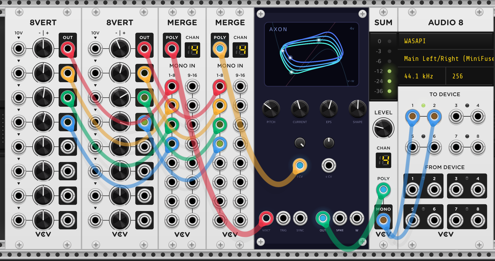

# Soma (Hindmarsh–Rose)

Bursting/chaotic neuron oscillator for VCV Rack 2, and one half of Coalescent's
**neuron pair** — [Axon](axon.md)'s sibling, with which it shares an RK4
integration strategy. Part of the **Coalescent** plugin's *Fluctuations* series —
see the [main README](../README.md).

Both neuron modules are **polyphonic** (up to 16 voices) — see [Axon's Polyphony
section](axon.md#polyphony), which applies identically here.



Soma is Axon's sibling, built on the **Hindmarsh–Rose** (HR) model. HR adds a
third, *slow* state variable `z` (adaptation) to the two fast variables, and that
extra variable is exactly what turns single spikes into **bursts** — trains of
spikes separated by quiescence — and, in a window of injected current, into
**chaos**. As in Axon, the membrane potential `x` is the audio output and pitch
is the simulation speed.

## How it works

```
dx/dt = y − a·x³ + b·x² − z + I      (fast: membrane potential, audio out)
dy/dt = c − d·x² − y                 (fast recovery / spiking)
dz/dt = r·( s·(x − x_R) − z )         (slow adaptation / bursting)
```

The fast `(x, y)` pair spikes much like Axon; `z` integrates slowly (rate `r`) and
pulls the current down until the cell falls silent, then drifts back and lets the
next burst start. **CURRENT** (`I`) sets the regime — quiescent → tonic spiking →
bursting → chaos. **BURST** (`r`) is how slow that adaptation is: small `r` = long
slow bursts, large `r` → tonic spiking. **ADAPT** (`s`) is the adaptation strength
(burst depth/shape). `a, b, c, d, x_R` are fixed at the standard HR values.

It uses the **same RK4 integration strategy as Axon** — pitch-adaptive substepping —
just with the third equation added.

### Pitch tracks the spike rate

HR's period varies enormously between regimes (a tonic spike train is ~3× faster
than the within-burst spikes at the default voicing), so pitch is calibrated to
the **within-burst spike rate**: `RATE_CAL` makes the default bursting voicing buzz
at C4. Switching to tonic spiking therefore reads about an octave-and-a-half higher,
and CURRENT/BURST/ADAPT pull the pitch — open-loop and deliberate, like Axon.

## Controls

| Control | Range | Purpose |
| --- | --- | --- |
| **PITCH** | ±4 oct | simulation speed (audio pitch); 0 = C4 at default voicing |
| **CURRENT** | 0.4 … 4.0 | injected current `I`; regime control (quiescent / tonic / bursting / chaos). Chaos sits near 3.25 |
| **BURST** | r ≈ 0.001 … 0.05 | adaptation rate (log-mapped); small = long bursts, large = tonic |
| **ADAPT** | 1.0 … 5.0 | adaptation strength `s` (burst depth) |

**CURRENT** and **BURST** have attenuverters + CV inputs. **V/OCT** sums with
PITCH. **TRIG** injects a decaying current pulse on each rising edge — from a
sub-threshold CURRENT that kicks off a single burst (a percussive HR voice).
**SYNC** hard-resets the cell (all three state variables) to rest on a rising
edge, for rhythmic locking and hard-sync timbres.

Outputs: **OUT** — `x`, soft-clipped (`tanh`) and DC-blocked. **SPIKE** — a
10 V / ~1 ms pulse per spike (so a burst emits a little flurry of triggers).
**Z** — the slow adaptation variable as a ±5 V CV: the **burst envelope**, ideal
for opening a filter/VCA in time with the bursts. Not high-passed.

## Display

The screen traces the HR attractor in the `(x, z)` plane: fast spikes sweep
horizontally while the slow `z` drifts up and down, so a burst reads as a cluster
of spikes climbing along `z` and the silent gap as the slow return. In the chaotic
window the trail never quite repeats. The faint diagonal is the `z`-nullcline
`z = s·(x − x_R)`, where the slow drift reverses.

## Patches

`tools/make_patches_neuron.py` also writes six Soma patches:

- **soma_1_bursting** — the default bursting voicing → audio
- **soma_2_chaos** — CURRENT = 3.25, the classic HR chaotic regime
- **soma_3_blips** — sub-threshold CURRENT, an LFO clocking TRIG to fire bursts
- **soma_4_zmod** — Z self-patched into CURRENT CV: a self-evolving burst texture
- **soma_5_sync** — an LFO clocking SYNC: each edge restarts the burst, locking it
  to the clock (rhythmic hard reset)
- **soma_6_poly** — 4 voices spread across pitch and CURRENT, the four currents
  walking from tonic spiking up into the chaotic window, so each coloured voice
  draws a distinctly different (x,z) attractor. Summed to mono through Sum

`tools/stability/soma.cpp` (calibration/stability/pitch) and
`tools/render_wav_soma.cpp` (offline audition) are the Soma counterparts of Axon's
tools. The same notes as Axon apply (state not saved, pitch approximate, OUT
DC-blocked / Z not, and the same right-click **Anti-aliasing** oversampling
option for high notes).

```bash
g++ -O2 -o /tmp/t tools/stability/soma.cpp && /tmp/t      # exit 0 = pass
```

## Deferred

Closed-loop pitch tracking; per-spike velocity output; a regime/MODE switch to
recalibrate pitch to the burst (vs spike) rate.

## References

- J. L. Hindmarsh, R. M. Rose, *A model of neuronal bursting using three coupled
  first order differential equations*, Proc. R. Soc. Lond. B 221 (1222), 1984.
- [Hindmarsh–Rose model — Wikipedia](https://en.wikipedia.org/wiki/Hindmarsh%E2%80%93Rose_model)
